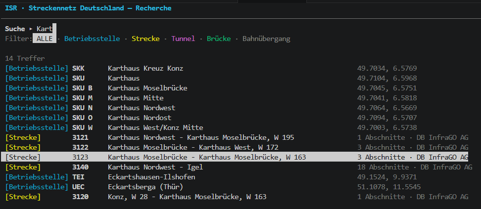
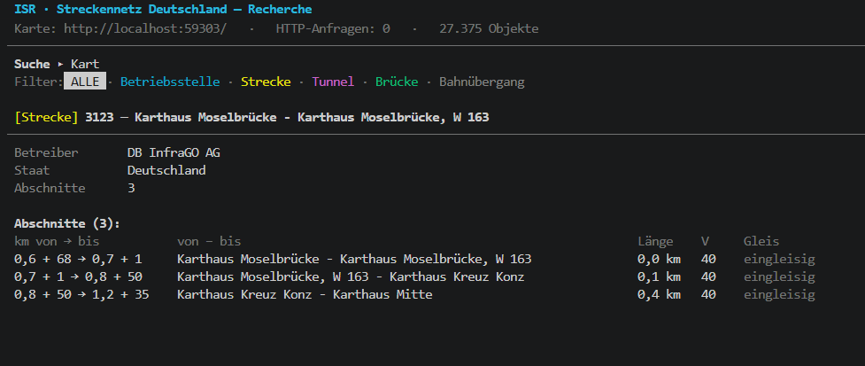
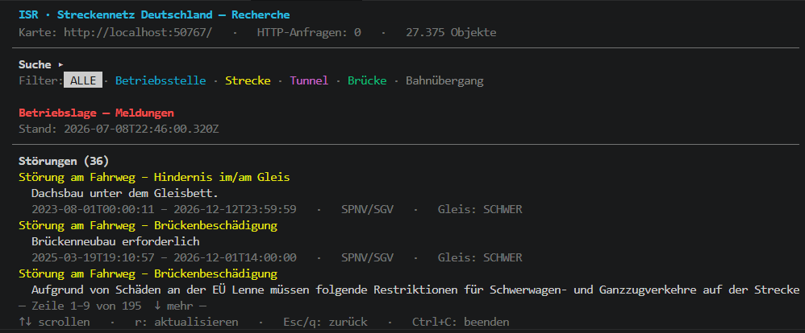

# Bahn-Infrastructure





## Schnellstart

Voraussetzung: **Node.js ≥ 18**. Dann:

```
npm install                # einmalig – Server-Tooling (TypeScript + tsx)
npm --prefix web install   # einmalig – Frontend (Next.js + MapLibre GL)
npm run build:web          # Frontend bauen (statischer Export nach web/out)
npm start                  # startet Server + Karte + Recherche-TUI
```

Frontend-Entwicklung mit Hot-Reload: `npm run dev:web` (Next-Dev-Server auf Port 3000,
proxied `/api` und `/data` auf den lokalen Server – Port via `API_PROXY` übersteuerbar).
Der Server ist federführend für alle Daten: Live-Züge kommen über `/api/livetrips`
(Transitous-Proxy mit 10-s-Burst-Cache), die Betriebslage über `/api/streckeninfo`.
